# User-defined composite JSON

On approval, write this document unchanged in substance to [`.agents/user-defined-composites-plan.md`](.agents/user-defined-composites-plan.md). Do not implement the feature in that step. If that file already exists, replace it. Do not edit other files under `.agents/`.

## 1. Executive Summary

A composite in this workbench is a process-bigraph document (`name` + `state`, plus optional `description`, `tags`, `parameters`, `requires`), not a generic component tree. [`load_spec`](vivarium_workbench/lib/composite_lookup.py) already parses `*.composite.json`. [`discover_workspace_composites`](vivarium_workbench/lib/composite_lookup.py) already scans `<package_path>/composites/`. [`promote_composite_to_catalog`](vivarium_workbench/lib/composite_mutations.py) already writes a new catalog file there as YAML.

The gap is authoring and lifecycle, not discovery. Invalid files are skipped with no error. There is no schema version, no import/remove API, no provenance distinguishing a user file from an installed package, and no JSON Schema for editors.

Recommendation: keep one pipeline. User composites are `*.composite.json` files inside the workspace package catalog directory. Validate them before they are accepted. Surface isolated errors for files that fail. Never store them under `~/.local/share`, because composites are workspace scientific artifacts, already git-backed and already discovered from the package tree.

## 2. Current Architecture Findings

- **Document shape.** [`_spec_record`](vivarium_workbench/lib/composite_lookup.py) requires a dict with `name` and `state`. Id is `<package>.composites.<stem>`, where the stem is the filename without `.composite.yaml`, `.composite.yml`, or `.composite.json`. Display `name` is independent of the id.
- **Sources, in precedence order** inside [`discover_all_composites`](vivarium_workbench/lib/composite_lookup.py): workspace package directory, then installed `pbg-*` distributions (only if the id is absent), then federated `external/*/…/composites/` via `setdefault`, then `@composite_generator` functions from the env worker. [`composites_data`](vivarium_workbench/lib/composite_lookup.py) strips `_`-prefixed keys, sets `kind` (`spec` or `generator`), `workspace_local`, and runs `filter_composites` plus `_dedupe_alias_composites`.
- **Resolve.** [`composite_resolve.py`](vivarium_workbench/lib/composite_resolve.py) tries the generator registry, then `find_composite_path` and `CompositeSpec.from_file`. A parse failure becomes a degraded 200 (`wiring_status: unavailable`), not a catalog-wide failure. An unknown id is 404.
- **Catalog vs composites.** `GET /api/catalog` and `GET /api/marketplace` ([`build_catalog`](vivarium_workbench/lib/catalog.py)) list installable *modules*. `POST /api/catalog-install` installs a PyPI package or a git submodule under `external/<name>/`. That is not how a single composite file should be added. The page the user pointed at (`main#viv-content`, “Composites N / Processes N”) is the registry chrome in [`walkthrough.js`](vivarium_workbench/static/walkthrough.js): counts come from `GET /api/registry` and `GET /api/composites`. Cards render in `_renderRegistryComposites` into `#registry-composites-container`.
- **Writes today.** Promote creates `<pkg>/composites/<target>.composite.yaml` and returns 409 if that path exists. It uses a plain `write_text`, not [`atomic_write_text`](vivarium_workbench/lib/atomic_io.py). The FastAPI route does not commit; the old server path committed via `_commit_or_run` (deferred).
- **User-data dirs.** [`lib/user_dirs.py`](vivarium_workbench/lib/user_dirs.py) is for preferences and the assistant. Composites do not belong there.
- **Validation today.** Discover wraps parse and `_spec_record` in `except: continue`. Missing `name` or `state` returns `None` and the file vanishes. There is no composite JSON Schema in this repo. Workspace `.pbg/schemas/` validators cover workspace, study, and investigation documents, not composites. Pydantic `CompositeRecord` / `CompositesPayload` in [`lib/models.py`](vivarium_workbench/lib/models.py) are API DTOs with `extra="allow"`.
- **Tests to preserve.** [`tests/test_composites_kind_module.py`](tests/test_composites_kind_module.py), [`tests/test_composite_mutations_lib.py`](tests/test_composite_mutations_lib.py), [`tests/test_composite_resolve_fallback.py`](tests/test_composite_resolve_fallback.py), [`tests/test_composite_explorer_api.py`](tests/test_composite_explorer_api.py), federation tests, and the increase-demo fixture [`increase-demo.composite.yaml`](tests/_fixtures/ws_increase_demo/pbg_ws_increase_demo/composites/increase-demo.composite.yaml).

## 3. Recommended Architecture

Do not add a parallel `CompositeCatalog`. Extend the existing scan.

- **`composite_schema.py` (new, `lib/`)** — schema version constant, stem rules, structural validation, error objects. Pure functions. No I/O.
- **`composite_lookup.py` (extend)** — `load_spec` stays the parser. `_scan_composites_dir` records failures instead of swallowing them. `composites_data` adds `origin` and returns `composite_errors` beside `composites`.
- **`composite_files.py` (new, `lib/`)** — install, replace, and remove under the workspace catalog directory. Uses `atomic_write_text`. Refuses paths outside that directory.
- **`composite_mutations.py`** — import/remove handlers next to `promote_composite_to_catalog`, same `(dict, status)` contract.
- **`api/app.py`** — three routes, CSRF already covers POST/DELETE.
- **UI** — import, reload, remove, source badge, and an error list in the Composites tab. No new framework.

Built-in and installed composites keep flowing through the same `discover_all_composites` union. User files are the workspace-local spec source. Generators stay Python and are out of scope.

```mermaid
flowchart LR
  jsonFile["stem.composite.json"] --> parse["load_spec"]
  parse --> schema["validate_composite_document"]
  schema --> record["_spec_record"]
  record --> merge["discover_all_composites"]
  merge --> api["GET /api/composites"]
  api --> ui["Composites tab"]
  importBtn["Import"] --> files["composite_files.install"]
  files --> jsonFile
```



## 4. Composite JSON Format

Schema version **1** is the document already loaded today, plus optional authoring metadata. `schemaVersion` is optional. Absence means version 1, so every existing YAML and JSON composite remains valid.

Required:

- `name` — non-empty string, display name. Max 200 characters.
- `state` — JSON object. This is the process-bigraph state tree (`_type`, `address`, `config`, `inputs`, `outputs`, nested stores). The workbench does not reimplement bigraph-schema; it checks that `state` is an object and that nesting/size stay inside the limits in section 9.

Optional:

- `schemaVersion` — integer `1`. Any other integer is unsupported.
- `description` — string, max 8_000 characters.
- `tags` — array of strings, each max 64 characters, max 32 tags.
- `author` — string, max 200 characters. Informational. Not part of the id.
- `version` — string, max 64 characters. Document revision label, not the schema version and not a semver resolver. Two files are not merged by version.
- `parameters` — object. Each value is an object with optional `type` (`float`, `int`, `str`, `bool`), `default`, `description`, `min`, `max`. This matches [`substitute_parameters`](vivarium_workbench/lib/composite_lookup.py).
- `requires` — object, typically `processes` and/or `steps` string arrays. Informational for the card; unresolved names are warnings, not hard failures, because processes may be installed later.
- `address` strings inside `state` stay process-bigraph addresses (`local:IncreaseProcess`, or a dotted class path). They are not filesystem paths.

Identity:

- Catalog id is `<package_path>.composites.<stem>`, derived from the installed filename, not from `name`. Stem must match `^[a-zA-Z][a-zA-Z0-9_-]{0,63}$`.
- `name` may differ from the stem (promote already does this).

Unknown fields: preserved on disk and ignored by `_spec_record` (it already copies only known keys into the API record). This is forward compatible. A later schema version may promote a key to required.

`$schema`: optional string. If present it must be the relative or absolute URL documented for version 1 (`vivarium-workbench/composite.schema.json`). It is not fetched at runtime. Editors use it; the loader does not.

Compatibility:

- Version omitted or `1`: accept.
- Version greater than the build supports: reject that file, keep the rest of the catalog, tell the user which workbench version they need.
- Version `0` or a non-integer: reject.
- Adding optional keys is a non-breaking revision of version 1. Removing or retyping a required key requires `schemaVersion: 2` and a documented migration. Do not silently rewrite user files.

Example, adapted to the increase-demo fixture rather than a fake `components` array:

```json
{
  "$schema": "https://vivarium.science/schemas/composite-1.schema.json",
  "schemaVersion": 1,
  "name": "increase-demo",
  "description": "Trivial linear-growth composite.",
  "version": "1.0.0",
  "author": "workspace",
  "tags": ["fixture"],
  "parameters": {
    "rate": { "type": "float", "default": 2.0 }
  },
  "requires": { "processes": ["IncreaseProcess"] },
  "state": {
    "increase": {
      "_type": "process",
      "address": "local:IncreaseProcess",
      "config": { "rate": "${rate}" },
      "inputs": { "level": ["stores", "level"] },
      "outputs": { "level": ["stores", "level"] }
    },
    "stores": { "level": 0 }
  }
}
```

Publish the Draft 2020-12 schema as `docs/schemas/composite-1.schema.json` and one example under `docs/examples/custom-composite.composite.json`. Do not put the schema inside a workspace; it is workbench documentation.

## 5. Storage and Discovery Model

Location: `<workspace>/<package_path>/composites/<stem>.composite.json`.

`package_path` comes from `workspace.yaml`, with the same fallback promote uses (`pbg_` + name). One file is one composite. UTF-8, no BOM required. Nested directories are not scanned (current `glob` is not recursive). Do not add recursion in v1; it would change ids and hide files from the existing scanner.

Manual placement and in-app import share `validate_composite_document` + `load_spec`.

- Import copies bytes into the catalog directory after validation. The original path is not retained as a live reference, so renaming the source later does not surprise the catalog.
- A file edited in place is picked up on the next `GET /api/composites` (discovery is already per request, with the env-worker cache). Provide an explicit Reload action that busts that cache. No filesystem watcher in v1.
- Rename on disk changes the stem and therefore the id. Studies that referenced the old id become unresolved; that is existing ref-lint behavior, not a new migrator.
- Delete on disk removes it from the next listing.
- Writes go through `atomic_write_text` so a crash cannot leave a half-written JSON file that `json.loads` would skip forever.
- Same-directory `*.tmp` files are not scanned (they do not match `*.composite.json`).

Why not `~/.local/share/vivarium-workbench/composites/`: those files would not be in the workspace git history, would not travel with the workspace, and would need a second discovery root. User-data stays for preferences.

## 6. Catalog Integration

Provenance on each list record, additive fields:

- `origin`: `workspace` | `installed` | `federated` | `generator`. Set in `discover_all_composites` where each source is merged.
- `format`: `json` | `yaml` | `generator`.
- `schemaVersion`: integer or null.
- `read_only`: true for `installed`, `federated`, and `generator`. False for workspace files. Federation already sets `read_only` on its records; do not overwrite that.
- `source`: relative path, already present for specs.

Merge rules, unchanged except for error reporting:

- Workspace id wins over an installed package with the same id (current `if spec_id not in out`). Do not add a new override flag. A user file cannot impersonate `pbg_something.composites.foo` because the package prefix is the workspace package, not the foreign package.
- Duplicate stem in the workspace directory cannot happen for two files with the same name. If both `.composite.json` and `.composite.yaml` share a stem, prefer `.composite.json` when it validates, and emit a warning that the yaml twin is shadowed. Deterministic, documented.
- Generators with the same id as a file: keep today's generator-vs-spec rank in `_dedupe_alias_composites`. Do not change that ranking.
- Invalid user files are omitted from `composites` and listed in `composite_errors`. The rest of the catalog still loads. Installed-package scan failures stay best-effort skips (those trees are not the user's authoring surface) but workspace-directory failures are always reported.

`filter_composites` must not drop a workspace-local composite that the workspace did not list in an include-allowlist if that would hide a file the user just imported. Verify the allow-list semantics in `workspace_manifest_views.filter_composites` during implementation and exempt `origin: workspace` if the allow-list would hide it. That exemption is the one behavioral change that needs a regression test against a workspace that sets `dashboard.registry.include`.

## 7. Import / Update / Removal Workflows

Import (`POST /api/composites/import`):

1. Body is either raw JSON `{document, stem}` or multipart is unnecessary; send `{stem, document}` where `document` is the parsed object. The browser reads the file. The server never receives a client path.
2. Validate stem.
3. `validate_composite_document(document)`.
4. Resolve catalog dir from `workspace.yaml`. Reject if the resolved directory is not inside `ws_root` (`Path.relative_to`).
5. If `<stem>.composite.json` or `<stem>.composite.yaml` exists, return 409 with the relative path. Do not overwrite unless the request sets `replace: true`, and `replace` is allowed only when the existing file's `origin` would be `workspace`.
6. `catalog_dir.mkdir(parents=True)`.
7. `atomic_write_text` of canonical JSON (`json.dumps`, UTF-8, trailing newline, `allow_nan=False`).
8. Return `{ok, id, name, path, origin: "workspace", warnings: [...]}`.

The client reloads `GET /api/composites`. Cache bust: call the existing composites cache invalidation if `composites_via_subprocess` caches a warm worker result; find that hook beside `composites_query` and invoke it after a successful write or delete. If no invalidation hook exists, add a generation counter the list endpoint already consults, or document that Reload passes `?refresh=1` which skips the warm cache.

Update:

- External edit: user saves the file; Reload refetches. Validation errors show on that file while other cards remain.
- Re-import with the same stem and `replace: true` rewrites atomically. `name` may change; stem/id do not, unless the user passes a new stem, which is a new file plus an optional remove of the old one (two steps, so a failed write cannot delete the old file).
- No in-app JSON editor in v1. The configure modal stays the run-parameter UI.

Remove (`DELETE /api/composites/{stem}`):

- Resolve the path. It must be a direct child of the workspace catalog dir, named `<stem>.composite.json` or `.composite.yaml` / `.yml`.
- Refuse stems that fail the regex, paths that escape the directory, and anything whose discovered `origin` is not `workspace`.
- `Path.unlink` of that one file. Do not `rmtree`. Do not touch `external/` or site-packages.
- 404 if absent. 200 `{ok, removed}`.
- Deleting the file manually is equivalent on the next reload.
- No extra cache beyond the list cache. Run history in `studies/*/runs.db` is not deleted; past runs may still name the composite id. That is correct.

Open-folder and Reload are UI-only: Reload refetches; Open folder can be omitted in v1 if there is no existing “reveal in finder” API. Do not add a shell-open endpoint.

## 8. Validation and Error Handling

Layers, all inside `validate_composite_document` plus `load_spec`:

- **Syntax** — `json.JSONDecodeError` / `yaml.YAMLError`. Message includes path, line, and column when the parser provides them.
- **Schema** — type and presence checks above. Property path in JSON Pointer form (`/state/increase/address`).
- **Semantic** — stem grammar; `parameters` values are objects; `${name}` placeholders in `state` refer to keys in `parameters` (warning if not, because defaults can still be injected later); `address` values are strings and must not contain `..`, NUL, or start with `/` or a scheme other than the process address form. Do not resolve `local:` against the registry as a hard error.
- **Catalog** — stem collision 409; unsupported `schemaVersion`; file not inside the catalog dir.

Error object:

```json
{
  "category": "schema",
  "path": "/state",
  "file": "pbg_demo/composites/broken.composite.json",
  "message": "state must be a JSON object.",
  "hint": "The process-bigraph state tree is an object of stores and processes, not an array."
}
```

Categories: `syntax`, `schema`, `semantic`, `conflict`, `io`, `unsupported_schema`.

Examples:

- `syntax` — `pbg_demo/composites/broken.composite.json: line 4: Expecting property name. The file is not valid JSON.`
- `schema` — `/name is required. Add a non-empty name.`
- `unsupported_schema` — `schemaVersion 2 is not supported by this workbench (max 1).`
- `conflict` — `increase-demo.composite.yaml already exists. Choose another stem or import with replace.`
- `io` — `Could not write pbg_demo/composites/ (permission denied).`

One bad workspace file appends to `composite_errors` and does not clear `composites`. A failure inside import returns 400/409/500 for that request and does not modify an existing file (atomic replace only after validation; on write failure the previous file remains because `os.replace` has not happened, or the `.tmp` is unlinked).

Permission denied and missing `workspace.yaml` map to 500 with `category: io`, same style as promote's 500. Missing catalog directory is created on import; on discovery, a missing directory yields an empty workspace contribution and no error.

## 9. Security and Robustness

Treat the document as untrusted.

- Server chooses the destination path from the sanitized stem. Client paths are ignored.
- Reject stems with `/`, `\`, `.`, `..`, or leading dashes.
- `relative_to(ws_root)` after resolve; refuse symlinks that point outside the catalog dir (`Path.resolve` must stay under the resolved catalog dir). Do not follow a symlink that lands in `site-packages` or `external/`.
- Max file size 1 MiB on read. Max JSON depth 64. Max state nodes 10_000 (count objects and arrays while walking). Exceeding either is `schema` / `semantic` and skips the file.
- `json.loads` only (no `yaml.load` with a loader other than `safe_load`, which `load_spec` already uses). `allow_nan=False` on write.
- UTF-8 with `errors` not replaced silently: `read_text(encoding="utf-8")` already raises on illegal bytes; catch and report `syntax`.
- No URL fetch for `$schema` or for addresses.
- `address` must be a string. Reject values that look like filesystem paths (`/…`, `../`, `file:`).
- Do not `eval` or import a module named by the document.
- Duplicate ids within one scan: last-writer does not win silently; the shadowing rule in section 6 emits a warning.
- Generator composites and installed packages are not writable through these routes.

## 10. Required Code Changes

- Validation module and JSON Schema document.
- Scan reports workspace errors; list payload grows additive fields.
- Install/remove helpers with atomic writes and path confinement.
- Two HTTP routes plus pydantic models.
- Composites tab: import, remove for `origin === "workspace"`, error banner, Local / Installed / Federated badge.
- Tests listed in section 14.
- Short authoring note in `docs/` next to the schema. Do not rewrite `docs/ARCHITECTURE.md` beyond a short paragraph if that file already defines the composite id; a one-paragraph addition is justified because the id rule is documented there.

No changes to `catalog_install`, marketplace modules, run subprocess, or the assistant.

## 11. File-by-File Change Plan

- [`vivarium_workbench/lib/composite_schema.py`](vivarium_workbench/lib/composite_schema.py) — new. `SCHEMA_VERSION = 1`, `STEM_RE`, `validate_composite_document(doc) -> list[Issue]`, `walk limits`. Why: one validator for import and discovery. Depends on nothing in `lib` except types. Edge: non-dict root, huge nesting. Tests: `tests/test_composite_schema.py`.
- [`vivarium_workbench/lib/composite_lookup.py`](vivarium_workbench/lib/composite_lookup.py) — `_scan_composites_dir` returns `(records, errors)` or stores errors on a side structure `discover_workspace_composites` already can return alongside. Stop bare `continue` for workspace scans only. Set `origin` / `format` / `schemaVersion` in `_spec_record`. `composites_data` adds `composite_errors`. Why: malformed JSON must be visible. Edge: yaml and json twins; generator dedupe unchanged. Tests: extend `tests/test_composites_kind_module.py` and a new discovery test with a bad fixture file.
- [`vivarium_workbench/lib/composite_files.py`](vivarium_workbench/lib/composite_files.py) — new. `catalog_dir(ws_root)`, `install_document`, `remove_stem`. Uses `atomic_write_text` and `validate_composite_document`. Why: keep path policy out of the route. Edge: symlink escape, 409, replace false by default. Tests: `tests/test_composite_files.py` on tmp workspaces.
- [`vivarium_workbench/lib/composite_mutations.py`](vivarium_workbench/lib/composite_mutations.py) — `import_composite` and `remove_composite` returning `(dict, int)`, mirroring promote's status codes. Why: routes stay thin. Tests: `tests/test_composite_mutations_lib.py`.
- [`vivarium_workbench/lib/models.py`](vivarium_workbench/lib/models.py) — `CompositeImportRequest`, `CompositeImportResult`, optional fields on `CompositeRecord` (`origin`, `format`, `schemaVersion`) with `extra="allow"` so old clients ignore them. `CompositesPayload` gains `composite_errors: list`. Why: typed contract and TS generation via `lib/generate_ts.py` if that file is regenerated for touched models. Tests: `tests/test_api_app.py` route smoke.
- [`vivarium_workbench/api/app.py`](vivarium_workbench/api/app.py) — `POST /api/composites/import`, `DELETE /api/composites/{stem}`. Same JSONResponse status pattern as promote. Why: CSRF middleware already guards these methods. Edge: stem path parameter must be matched against `STEM_RE` before filesystem use.
- [`vivarium_workbench/lib/composites_query.py`](vivarium_workbench/lib/composites_query.py) — pass `composite_errors` through the subprocess list cache and honor refresh after import. Why: otherwise the UI reloads a stale warm worker. Tests: existing composites query tests plus one refresh case.
- [`vivarium_workbench/static/walkthrough.js`](vivarium_workbench/static/walkthrough.js) — in `_renderRegistryComposites` and the empty state: Import control, error list, badge from `origin`, Remove only when `workspace_local && origin === "workspace"`. Wire to `apiFetch`. Why: this is the Composites tab the registry page already uses. Do not add a second catalog page. Snapshot/read-only: hide Import and Remove when `DataSource` is static (`data-source.js`).
- [`vivarium_workbench/static/data-source.js`](vivarium_workbench/static/data-source.js) — `loadComposites` already returns the JSON; ensure `composite_errors` is not stripped. No write methods on the static source.
- [`docs/schemas/composite-1.schema.json`](docs/schemas/composite-1.schema.json) and [`docs/examples/custom-composite.composite.json`](docs/examples/custom-composite.composite.json) — authoring artifacts. A short `docs/composites.md` section or a new `docs/custom-composites.md` that states id = package + stem, schemaVersion optional, and the import/remove rules.
- Theme: any new controls use existing `var(--token)` classes (`btn`, badges). No new hex in `style.css`. If a badge needs a modifier, add a class that only references tokens, or reuse `repo-badge-imported`.

## 12. API / Interface Changes

Additive:

- `GET /api/composites` gains `composite_errors` and per-item `origin`, `format`, `schemaVersion`. Existing fields stay. `kind: "spec"` stays.
- `POST /api/composites/import` — body `CompositeImportRequest`: `stem`, `document` (object), `replace` (bool, default false). Responses 200, 400, 409, 500.
- `DELETE /api/composites/{stem}` — 200, 400 (bad stem), 403 if the resolved file is not workspace-local, 404.

Unchanged: `/api/catalog`, `/api/marketplace`, `/api/catalog-install`, `/api/composite-resolve`, `/api/composite-promote-to-catalog`.

Publish bundles: `publish.py` should emit `composite_errors` if it serializes the composites payload, so a published snapshot can show a broken local file as an error instead of hiding it. Confirm the publisher calls `composites_data`.

## 13. UI / UX Changes

v1, on the existing Composites tab:

- Button **Import composite** opens a file picker (`accept=".json,application/json"`). Read as text, `JSON.parse`, POST the object. Do not send the filesystem path.
- On success, reload the list and select/scroll to the new card.
- On failure, show the server `message` and `hint` inline. Do not use `alert` if the tab already has an error region; a small `.form-error` block is enough.
- Each card shows a badge: **Local**, **Installed**, **Federated**, or **Generator**. Local cards get **Remove**, with a confirm step that names the stem. Installed cards do not.
- A dismissible list above the cards for `composite_errors` (path, message, hint).
- **Reload** refetches. Keyboard: the new buttons are real `<button>` elements with names, not icon-only.
- Empty state copy mentions that a `.composite.json` file can also be placed in `<package>/composites/`.

Later, not v1: in-app editor, open-in-folder, watch mode, diff on replace, schema migration wizard.

Read-only published dashboards hide Import and Remove.

## 14. Testing Strategy

Unit (`tests/test_composite_schema.py`):

- Valid increase-demo-shaped JSON, including omitted `schemaVersion`.
- Invalid JSON is the loader's job; schema tests start from a parsed object: missing `name`, `state` as array, bad tag type, `schemaVersion: 2`, extra unknown key accepted, placeholder `${missing}` yields a warning not an error.
- Stem rejects `../x`, `a/b`, empty, `1starts-with-digit` (decide and test: leading letter required).

Integration (`tests/test_composite_files.py`, `tests/test_composite_mutations_lib.py`):

- Import into a tmp workspace with `workspace.yaml` and `package_path`. File appears. `composites_data` lists it with `origin: workspace` beside a pre-existing yaml composite.
- Second import without `replace` is 409 and the file bytes are unchanged.
- `replace: true` swaps content; a concurrent reader-style check that a failed validation does not truncate the old file.
- Delete removes only that file. Delete of an id that would be `installed` is 403.
- Restart is just a second `composites_data` call; the file is still there.
- Directory containing one valid JSON, one valid YAML, and one broken JSON: two records plus one `composite_errors` entry.
- Built-in fixture `ws_increase_demo` list snapshot stays stable aside from new additive fields (update assertions that require exact keys; do not weaken presence of `increase-demo`).

Filesystem:

- Missing `composites/` is created on import.
- Unwritable directory surfaces `io` and writes nothing (mock `atomic_write_text` or chmod if the test user can).
- Symlink inside `composites/` pointing outside `ws_root` is refused.
- File larger than 1 MiB is refused without loading the full tree into the catalog.

Regression:

- `promote_composite_to_catalog` still writes YAML and still 409s.
- Generator composites still list.
- Federation `read_only` still true.
- Resolve of a valid new JSON file returns a usable document through `CompositeSpec.from_file` (one test).
- `tests/test_no_ai_deps.py` untouched.

UI: a focused test if the repo has a JS test harness for walkthrough is unlikely; cover the contract in the API tests. Optional later Playwright case is not required for v1.

## 15. Backward Compatibility

- Existing YAML composites with no `schemaVersion` keep loading.
- Ids do not change.
- API additions are optional fields. Clients that ignore unknown JSON keys keep working. Clients that assert exact key sets in tests will need fixture updates; that is a test change, not a user migration.
- No rewrite of user files. No database migration.
- Workspace include-allowlists: confirm and, if they would hide a newly imported workspace composite, exempt `origin: workspace` and test it. That is the only intended behavior change for existing workspaces.
- Published static bundles gain `composite_errors` only when the publisher is updated; old bundles simply lack the key and the UI must treat it as `[]`.

## 16. Implementation Phases

1. **Schema and validator** — `composite_schema.py`, docs schema, unit tests. No routes.
2. **Discovery errors and provenance** — lookup + `composites_data`. Existing composites still list; bad workspace files become `composite_errors`.
3. **Install and remove** — `composite_files.py`, mutation handlers, routes, models, cache refresh.
4. **UI** — import, badge, errors, remove, read-only hide.
5. **Docs and example** — schema, example JSON, short authoring doc.
6. **Hardening** — symlink, size, depth, allow-list exemption, publish payload. Re-run composite, federation, and API smoke tests.

Each phase is independently reviewable. Phase 2 is useful even without the button, because hand-placed files start producing errors.

## 17. Risks and Tradeoffs

- **Workspace directory vs user-data.** Workspace storage matches discovery and git audit. It does not give a per-user catalog shared across workspaces. That cross-workspace library is a future export, not v1.
- **Soft `local:` checks.** Hard-failing unknown processes would block import before dependencies are installed. Warnings are the right v1 default and can be upgraded later.
- **Warm composite cache.** Import can appear to no-op if the list is cached. Phase 3 must invalidate it or the feature will look broken.
- **YAML/JSON twin stems.** Preferring JSON is deterministic but surprising if both files exist. The warning is required.
- **Allow-list exemption** might show composites a workspace intentionally hid. Gate it on `origin: workspace` only, and test a hidden installed composite stays hidden.
- **No auto-commit.** Matches the current FastAPI promote route. Users commit from the existing Branches flow. Do not invent a second commit path.
- **`innerHTML` in walkthrough.js** is existing. New error text must be escaped with the file's `_esc` helper. Do not interpolate server messages raw.

## 18. Future Extensions

- `schemaVersion: 2` with an explicit migration note, never an in-place silent rewrite.
- In-app editor that round-trips the same validator.
- A workspace-level composite library that can be copied into another workspace's catalog (still files, still the same schema).
- Stricter address checks once `build_core()` is known warm.
- Filesystem watch, deferred because discovery is already request-scoped.

## 19. Acceptance Criteria

- A valid `*.composite.json` placed in `<package>/composites/` or imported through the API is listed on `GET /api/composites` with `origin: workspace` and the id `<package>.composites.<stem>`.
- It is still listed after a new process calls `composites_data` again.
- It renders on the Composites tab next to existing entries, with a Local badge.
- A broken JSON file produces `composite_errors` with path, category, message, and hint, and does not remove valid entries.
- Duplicate stem without `replace` is 409 and does not change the file.
- `replace: true` updates one workspace file atomically.
- Remove deletes only that workspace file and returns 403 for installed, federated, and generator entries.
- Existing YAML fixtures and promote-to-catalog behavior stay green.
- `schemaVersion` other than an omitted value or `1` is rejected for that file only.
- Docs include a versioned JSON Schema and one example.
- The plan file exists at `.agents/user-defined-composites-plan.md`.
