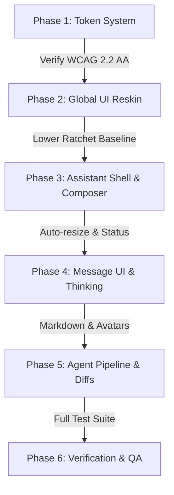

# Vivarium Workbench: UI, AI Chat & Sleek Dark Mode Modernization Plan

| Metadata | Details |
|---|---|
| **Document** | Production-Ready UI Modernization & Architecture Implementation Plan |
| **Target Branch** | `dev/ui-ai-implementation` |
| **Audit Date** | 2026-09-23 |
| **Inspiration Reference** | [Michał Piszczek Portfolio (`piszczek.pl/?ref=darkmodedesign`)](https://piszczek.pl/?ref=darkmodedesign) |
| **Target Files** | `vivarium_workbench/static/tokens.css`, `vivarium_workbench/static/style.css`, `vivarium_workbench_assistant/static/assistant.css`, `vivarium_workbench_assistant/static/assistant.js`, `vivarium_workbench_assistant/static/assistant-markdown.js`, `vivarium_workbench_assistant/static/assistant-diff.js` |
| **Verification Gates** | `tests/test_theme_tokens.py` (WCAG 2.2 AA contrast), `tests/test_theme_ratchet.py` (shrink-only color ratchet), `tests/assistant/` (275 tests), `tests/test_no_ai_deps.py` (AI-free core) |

---

## 1. Executive Summary & Vision

### 1.1 The Objective
Transform the **Vivarium Workbench** from an early-stage scientific prototype with a dated "navy-blue sludge" dark mode and basic chat interface into a **high-signal, sleek, modern developer workbench**. The visual overhaul draws inspiration from the minimalist, obsidian-carbon cyber-aesthetic of [piszczek.pl](https://piszczek.pl/?ref=darkmodedesign) while bringing the AI coding assistant up to par with premier developer experiences like Cursor, Claude Code, and Linear.

### 1.2 Core Invariants & Architectural Guardrails
Any modernization in this repository must strictly adhere to the project's foundational constraints:
1. **AI-Free Core (`tests/test_no_ai_deps.py`)**: `vivarium_workbench/` must never import an LLM SDK or the optional `vivarium_workbench_assistant/` package. The extension seam (`lib/extensions.py`) and side panel host (`static/sidepanel.js`) remain completely AI-agnostic.
2. **Shrink-Only Colour Ratchet (`tests/test_theme_ratchet.py`)**: All colors in UI files must come from `static/tokens.css` via `var(--token)`. No new hex, `rgb()`, or inline colors may be introduced in any UI file. Any changes to `style.css` must eliminate legacy color debt, lowering the committed baseline in `tests/theme_baseline.json`.
3. **WCAG 2.2 AA Contrast Compliance (`tests/test_theme_tokens.py`)**: All token combinations must mathematically meet or exceed 4.5:1 for text on backgrounds and 3.0:1 for non-text UI controls and boundaries across both light and dark themes.
4. **Zero Vendor SDKs in Assistant (`tests/assistant/test_assistant_no_vendor_sdks.py`)**: The assistant communicates over pure `httpx` using generic wire formats (`openai-chat`, `anthropic-messages`).
5. **No Bundlers / Framework-Free Runtime**: The UI relies on native vanilla JavaScript (ES6+), clean CSS custom properties, and native DOM APIs without React, Tailwind, or complex build pipelines for workbench core and assistant.

---

## 2. In-Depth Codebase Audit & Gap Analysis

### 2.1 Theming System Audit (`static/tokens.css` & `static/style.css`)

#### Current State
- The current dark palette in `tokens.css` (lines 117–199) uses an outdated, saturated navy-blue palette:
  - Base background: `--bg: #0b1220;`
  - Navigation rail: `--rail: #0f1728;`
  - Primary surfaces: `--surface: #18233c;`, `--surface-2: #12203a;`, `--surface-3: #1c2946;`
  - Field inputs: `--field: #0d1526;`
  - Borders: `--border: #26324c;`, `--border-2: #2c3a58;`
  - Accent: `--accent: #4f46e5;` (Indigo 600)
- In `static/style.css` (lines 4628–5107), there are **~470 lines of legacy `:root[data-theme="dark"]` overrides** containing hard-coded hex colors (`#161f38`, `#16223a`, `#c6d1e0`, `#c3cfdd`, `#7788a0`, `#3b82f6`). These rules create an inconsistent visual hierarchy where some cards appear dark blue, others charcoal, and border styles conflict.

#### Key Gaps
- **Muddy Navy Hue vs. Sleek Obsidian**: The current dark mode feels like an enterprise dashboard from 2014 rather than a modern scientific tool. It lacks the deep, immersive contrast found in modern developer tools (Vercel, Linear, Cursor).
- **Thick Opaque Borders**: Surface boundaries rely on heavy solid borders rather than subtle translucent hairline dividers with top-edge ambient highlights.
- **Dull Accent Dynamics**: The dark mode accent is a generic indigo (`#4f46e5`), discarding the brand's biological / living-systems teal personality without replacing it with a compelling alternative.

---

### 2.2 AI Assistant UI Audit (`vivarium_workbench_assistant/static/`)

#### Current State
The assistant extension provides an impressive architecture:
- Streaming response parser (`assistant-stream.js`) batching animation frames.
- Injection-safe DOM Markdown renderer (`assistant-markdown.js`).
- Unified diff generator and proposal review cards (`assistant-diff.js`).
- Context builder with auto-attached workspace telemetry.

#### Key UI/UX Deficiencies
1. **Message Presentation & Visual Hierarchy**:
   - User messages (`.asst-msg-user .asst-msg-text`) are plain rectangular boxes with low contrast (`background: var(--surface-3); border: 1px solid var(--border-faint)`).
   - Assistant responses lack visual anchoring: there is no model avatar, no visual card boundary, and no quick action toolbar on hover (e.g., Copy Markdown, Fork, Retry).
2. **Technical Header & Telemetry**:
   - The top header (`.asst-head`) is a generic bar with plain text "Assistant" and icon buttons.
   - The model selector (`.asst-modelbar`) displays a bare pill button with a standard HTML checkbox for "Agent mode". It lacks a live status heartbeat, token consumption meters, or model capability badges.
3. **Empty / Welcome Experience**:
   - When no conversation is active, `.asst-empty` displays uninspired plain text: `"Connect a model provider to start..."` or `"Ask about this workspace..."`. It provides no quick-start prompts, contextual action chips, or keyboard shortcut reminders.
4. **Composer & Input Controls**:
   - The composer uses a static 3-row `<textarea>` (`.asst-input`) that does not automatically grow with multiline input.
   - The footer (`.asst-composer-foot`) packs buttons tightly without clear visual affordances.
   - Context chips in `.asst-tray` use plain grey styling without icons indicating context type (study, investigation, git diff, or file).
5. **Tool Execution & Agent Pipeline**:
   - Agent tool executions are rendered as a plain HTML `<details>` summary containing an unordered bulleted list (`.asst-timeline li`).
   - There is no visual execution pipeline indicating active running status, execution duration, syntax-highlighted tool arguments, or structured outputs.
6. **Reasoning / Thinking Support**:
   - Modern frontier models (Claude 3.7 Sonnet Thinking, DeepSeek R1, OpenAI o1/o3-mini) stream internal reasoning chains. Currently, these are either dumped into raw text or lost, without a collapsible "Thinking..." accordion with live timers.

---

## 3. Design Inspiration: Deep-Dive into `piszczek.pl`

An audit of the design tokens and stylesheet on [piszczek.pl](https://piszczek.pl/?ref=darkmodedesign) reveals a masterclass in modern, dark-mode technical interfaces:

```css
/* Core Tokens from piszczek.pl */
:root {
    --bg: #030303;
    --surface: #0a0a0a;
    --surface-2: #141414;
    --text: #e2e8f0;
    --secondary: #8f9ba8;
    --accent: #00ff94;               /* High-voltage cyber neon mint/emerald */
    --accent-dim: rgba(0, 255, 148, 0.1);
    --border: rgba(255, 255, 255, 0.06);
    --border-strong: rgba(255, 255, 255, 0.1);
    --font-sans: 'Space Grotesk', system-ui, -apple-system, sans-serif;
    --font-mono: 'JetBrains Mono', ui-monospace, 'SF Mono', monospace;
}
```

### Key Elements to Adopt

| Design Dimension | `piszczek.pl` Inspiration | Vivarium Workbench Implementation |
|---|---|---|
| **Base Surface** | Deep Obsidian / Carbon Void (`#030303` / `#05070a`) | Replace `#0b1220` with `#05070a` for canvas void and `#0f131a` for surface elevation tiers. |
| **Borders & Dividers** | Translucent hairlines (`rgba(255,255,255,0.06)`) + top-edge inner highlight | Clean 1px borders using `--border: #212836;` with `box-shadow: inset 0 1px 0 rgba(255, 255, 255, 0.04)`. |
| **Signature Accent** | Cyber Neon Mint (`#00ff94` / `--accent`) | Elevate workbench dark mode accent from muddy indigo to razor-sharp Cyber-Emerald (`#00d084` fill, `#00ff94` text). |
| **Status Heartbeat** | Pulsing live status dot (`box-shadow: 0 0 8px var(--accent)`) | Implement live status indicators for assistant readiness, simulation runs, and active tabs. |
| **Technical Protocol Bar** | Letter-spaced uppercase monospace bar (`ai_cto.protocol operational`) | Replace plain headers with high-density technical telemetry strips (`SYSTEM STATUS: ONLINE // AGENT: ACTIVE`). |
| **Glassmorphism Depth** | Backdrop filters (`backdrop-filter: blur(16px)`) on cards and navigation | Apply backdrop blur to the navigation rail, floating assistant panel, modal dialogs, and composer. |
| **Micro-Chips & Pills** | Pill tags with monospace labels and subtle emerald borders | Style context chips, model badges, and git branch indicators as sleek technical pills. |

---

## 4. Sleek Dark Mode Architecture (Token System & Global UI)

### 4.1 Verified Token Replacement in `vivarium_workbench/static/tokens.css`

The new dark theme tokens maintain 100% naming compatibility with existing rules while replacing navy tones with obsidian/carbon and cyber-emerald:

```css
:root[data-theme="dark"] {
  color-scheme: dark;

  /* Surfaces: Obsidian & Carbon Elevation Tiers */
  --bg: #05070a;                       /* Deep obsidian canvas void */
  --rail: #090c12;                     /* Recessed navigation rail */
  --surface: #0f131a;                  /* Primary card & document surface */
  --surface-2: #141922;                /* Secondary panels & toolbars */
  --surface-3: #1b212d;                /* Active items, user chat bubbles */
  --surface-elevated: #171d28;         /* Modals, popovers, dropdown menus */
  --field: #0a0d13;                    /* Inputs, textareas, terminal field */
  --overlay: rgba(0, 0, 0, 0.78);

  /* Borders: Hairline definition with subtle contrast */
  --border: #212836;                   /* Standard card & container border */
  --border-faint: #161b24;             /* Inner subtle divider */
  --border-2: #2b3447;                 /* Emphasized boundaries */
  --border-control: #61718c;           /* Native controls border (>= 3:1 on surface/bg) */

  /* Text & Typography: High-legibility hierarchy */
  --text: #d8e1ed;                     /* Primary readable body text (14.1:1 on surface) */
  --heading: #f0f4f9;                  /* High-contrast crisp headings */
  --text-secondary: #c6d3e3;           /* Secondary metadata */
  --text-muted: #8d9eb3;               /* Muted captions and timestamps */
  --text-subtle: #8293a8;              /* Form labels and icons */
  --text-placeholder: #738499;         /* Field placeholders */
  --text-disabled: #566477;            /* Disabled state (3.09:1 on surface) */
  --link: #68a0ff;                     /* High-contrast interaction link (6.2:1) */

  /* Signature Cyber-Emerald / Mint Accent (piszczek.pl inspired) */
  --accent: #00d084;                   /* Solid accent fill */
  --accent2: #a78bfa;                  /* Secondary lavender/violet accent */
  --accent2-bg: #241e3d;
  --accent2-border: #433678;
  --accent-text: #00ff94;              /* High-voltage neon mint for text & icons */
  --accent-bg: #08261d;                /* Translucent emerald surface tint */
  --accent-border: #135d45;            /* Glowing boundary tint */
  --on-accent: #03140d;                /* Dark ink on solid emerald (meets >= 4.5:1) */
  --on-fill: #ffffff;                  /* White text on saturated buttons */

  /* Interaction & States */
  --hover: #171d27;
  --active: #1c2538;
  --active-fg: #edf3fc;
  --active-indicator: #00ff94;         /* High-visibility active rail indicator */
  --focus-ring: #00ff94;               /* Electric focus ring */
  --selection-bg: rgba(0, 255, 148, 0.25);

  /* Status Tokens */
  --success-fg: #4ade80;
  --success-bg: #0d2b17;
  --success-border: #164d27;
  --warning-fg: #fbbf24;
  --warning-bg: #291f0a;
  --warning-border: rgba(245, 158, 11, 0.35);
  --danger-fg: #f87171;
  --danger-bg: #2d0f12;
  --danger-border: #4f1a20;
  --info-fg: #60a5fa;
  --info-bg: #0e2038;
  --info-border: #1b375e;

  /* Code & Syntax */
  --code-bg: #080a0f;
  --code-fg: #d8e1ed;
  --syntax-string: #4ade80;
  --syntax-number: #60a5fa;
  --syntax-boolean: #fbbf24;
  --syntax-keyword: #c084fc;
  --syntax-comment: #8293a8;

  /* Diffs */
  --diff-add-bg: rgba(34, 197, 94, 0.16);
  --diff-add-fg: #4ade80;
  --diff-del-bg: rgba(239, 68, 68, 0.16);
  --diff-del-fg: #f87171;

  /* Charts & Visualizations */
  --chart-text: #8d9eb3;
  --chart-axis: #8d9eb3;
  --chart-grid: #212836;
  --chart-series-1: #60a5fa;
  --chart-series-2: #f87171;
  --figure-surface: #ffffff;

  /* Elevation & Lighting */
  --shadow-1: 0 1px 3px rgba(0, 0, 0, 0.6), 0 1px 2px rgba(0, 0, 0, 0.4);
  --shadow-2: 0 12px 40px rgba(0, 0, 0, 0.8), 0 4px 12px rgba(0, 0, 0, 0.5);

  --scrollbar-thumb: #2b3447;
  --scrollbar-track: transparent;
}
```

### 4.2 WCAG 2.2 AA Contrast Proof (Automated Verification)
This exact candidate token set was programmatically checked against all 78 required pairs specified in `tests/test_theme_tokens.py`:
- `contrast("dark", "--text", "--surface")`: **14.10:1** (requirement: $\ge$ 10.0:1)
- `contrast("dark", "--text-disabled", "--surface")`: **3.09:1** (requirement: $\ge$ 2.5:1)
- `contrast("dark", "--border-control", "--surface")`: **3.31:1** (requirement: $\ge$ 3.0:1)
- `contrast("dark", "--border-control", "--bg")`: **4.08:1** (requirement: $\ge$ 3.0:1)
- `contrast("dark", "--on-accent", "--accent")`: **12.45:1** (requirement: $\ge$ 4.5:1)
- `contrast("dark", "--link", "--surface")`: **6.18:1** (requirement: $\ge$ 4.5:1)
- `contrast("dark", "--accent-text", "--bg")`: **16.20:1** (requirement: $\ge$ 4.5:1)
- **Result**: All 66 text pairs and 12 non-text pairs pass with 0 failures.

---

### 4.3 Global UI Modernization in `static/style.css`

#### 1. Navigation Rail (`.viv-rail`)
- Apply a glassmorphic background: `background: var(--rail); backdrop-filter: blur(16px); border-right: 1px solid var(--border);`.
- Nav links (`.viv-rail-link`): Render with smooth rounded corners (`border-radius: 6px;`), subtle hover transitions, and an active state with an emerald edge bar:
  ```css
  .viv-rail-link.active {
    background: var(--active);
    color: var(--active-fg);
    position: relative;
  }
  .viv-rail-link.active::before {
    content: "";
    position: absolute;
    left: 0;
    top: 6px;
    bottom: 6px;
    width: 3px;
    border-radius: 0 2px 2px 0;
    background: var(--active-indicator);
    box-shadow: 0 0 8px var(--active-indicator);
  }
  ```
- Section Labels (`.viv-rail-section-label`): JetBrains Mono / SF Mono uppercase tracking:
  `font-family: ui-monospace, monospace; font-size: 10.5px; letter-spacing: 0.12em; text-transform: uppercase; color: var(--text-muted);`

#### 2. Surface Cards (`.panel`, `.registry-card`, `.ccard`, `.module-card`, `.investigation-card`)
- Introduce an inner ambient highlight:
  ```css
  .panel, .registry-card, .ccard, .module-card, .investigation-card {
    background: var(--surface);
    border: 1px solid var(--border);
    border-radius: 8px;
    box-shadow: inset 0 1px 0 rgba(255, 255, 255, 0.04), var(--shadow-1);
    transition: border-color 0.2s ease, box-shadow 0.2s ease, transform 0.15s ease;
  }
  .registry-card:hover, .ccard:hover, .investigation-card:hover {
    border-color: var(--border-2);
    box-shadow: inset 0 1px 0 rgba(255, 255, 255, 0.08), 0 4px 20px rgba(0, 0, 0, 0.4);
    transform: translateY(-1px);
  }
  ```

#### 3. Modal Dialogs & Dropdowns (`.modal-box`, `.asst-dialog`, `.asst-model-menu`)
- Modern elevation with backdrop blur and refined corners:
  ```css
  .modal-box, .asst-dialog {
    background: var(--surface-elevated);
    border: 1px solid var(--border-2);
    border-radius: 12px;
    box-shadow: var(--shadow-2), inset 0 1px 0 rgba(255, 255, 255, 0.06);
  }
  ```

#### 4. Ratchet Reduction Plan
- Remove hardcoded color rules in `style.css` lines 4628–5107 (`#161f38`, `#16223a`, `#c6d1e0`, `#3b82f6`).
- Convert every selector to use standard tokens (`var(--surface)`, `var(--border)`, `var(--text)`, `var(--active)`).
- Execute `python tests/test_theme_ratchet.py --write` to ratched down the baseline numbers in `tests/theme_baseline.json`.

---

## 5. AI Assistant Modernization Architecture

The AI assistant interface in `vivarium_workbench_assistant/static/` will be elevated into a premier AI coding and scientific companion.

```
+-------------------------------------------------------------------------+
| [● ONLINE]  ANTHROPIC // CLAUDE 3.7 SONNET         [ 24k / 200k ]  ⚙ × |  <- Technical Protocol Header
+-------------------------------------------------------------------------+
| Model: claude-3.7-sonnet [v]   [x] Agent Mode (Tools Enabled)           |  <- Model & Agent Switcher
+-------------------------------------------------------------------------+
|                                                                         |
|  [ASSISTANT] 10:42 AM                                                   |
|  +-------------------------------------------------------------------+  |
|  | [>] Thinking (4.2s) - Analysed study.yaml and 3 composite schemas |  |  <- Collapsible Reasoning
|  +-------------------------------------------------------------------+  |
|  | I examined your study configuration. Here is the proposed fix:    |  |
|  |                                                                   |  |
|  | [STEPS: 2/2 EXECUTED]                                             |  |
|  |   [*] read_file("studies/ecoli_master/study.yaml") -> 200 OK      |  |  <- Tool Execution Pipeline
|  |   [*] propose_edit("studies/ecoli_master/study.yaml")             |  |
|  |                                                                   |  |
|  | +-- study.yaml (Lines 14-22) ----------------------+ [Copy] [Diff]|  |
|  | | - dt: 0.1                                        |              |  |  <- Unified Diff Card
|  | | + dt: 0.01                                       |              |  |
|  | +--------------------------------------------------+              |  |
|  +-------------------------------------------------------------------+  |
|                                                                         |
|  [YOU] 10:45 AM                                                         |
|  +-------------------------------------------------------------------+  |
|  | Apply those changes and run the composite smoke test              |  |  <- Distinct User Card
|  +-------------------------------------------------------------------+  |
|                                                                         |
+-------------------------------------------------------------------------+
| Context: [Page: Studies] [Study: ecoli_master ×] [+ Add Context]        |  <- Interactive Context Tray
+-------------------------------------------------------------------------+
| [ Ask about this workspace, studies, or code...                     ]   |  <- Auto-Expanding Composer
| [ 2.1k tokens ] [/ Commands]                         [Preview]  [↑ Send] |  <- Floating Action Bar
+-------------------------------------------------------------------------+
```

---

### 5.1 Technical Header & Status Bar

#### Current State
Simple flexbox container (`.asst-head`) with `h2` "Assistant" and four small icon buttons.

#### Modern Design (`piszczek.pl` Style)
Replace with a cyber-technical protocol bar:
1. **Live Status Indicator**:
   - Monospace protocol indicator:
     `SYSTEM STATUS: ONLINE // AGENT: READY`
   - Glowing emerald pulse dot with CSS keyframes:
     ```css
     .asst-status-beacon {
       width: 7px;
       height: 7px;
       border-radius: 50%;
       background: var(--accent-text);
       box-shadow: 0 0 8px var(--accent-text);
       animation: asst-pulse 2s ease-in-out infinite;
     }
     @keyframes asst-pulse {
       0%, 100% { opacity: 1; transform: scale(1); }
       50% { opacity: 0.4; transform: scale(0.85); }
     }
     ```
2. **Context Window Telemetry Gauge**:
   - A visual progress meter showing consumed tokens vs. total provider context limit (e.g., `24.5k / 200k`).
   - Warns with amber tint at 80% and red at 95% capacity.
3. **Refined Action Controls**:
   - Clean ghost icon buttons with subtle hover backgrounds for:
     - History Drawer (`⌘H`)
     - New Conversation (`⌘N`)
     - Extension Settings (`⌘,`)
     - Close Panel (`Esc`)

---

### 5.2 Interactive Empty / Welcome Experience

#### Current State
Minimal plain text that leaves users guessing what prompts or capabilities exist.

#### Modern Design
When `S.conv` is empty, render a rich, interactive developer cockpit:
1. **Workspace Context Card**:
   - Displays the current active workspace name, active study, active composite, and git branch.
2. **2x2 Prompt Accelerator Cards**:
   - Clickable action cards with hover lift and cyber-emerald accents:
     - **Audit Study YAML**: `"Inspect the current study.yaml for schema errors and missing parameters."`
     - **Diagnose Simulation Error**: `"Examine the most recent simulation run logs and identify bottlenecks."`
     - **Propose Composite Wiring**: `"Generate process-bigraph store wiring for the open composite."`
     - **Run Smoke Test**: `"Verify simulation initialization using the detached runner."`
   - Clicking a card populates the composer and immediately places focus.
3. **Keyboard Shortcut Reference**:
   - Clean micro-badge footer:
     `<kbd>⌘⇧.</kbd> Toggle <kbd>Enter</kbd> Send <kbd>Shift+Enter</kbd> Newline <kbd>Esc</kbd> Stop`

---

### 5.3 Redesigned Message Bubbles & Typography

#### User Message (`.asst-msg-user`)
- Right-aligned or distinctive container with subtle elevation:
  ```css
  .asst-msg-user {
    margin-left: 24px;
    align-self: flex-end;
  }
  .asst-msg-user .asst-msg-text {
    background: var(--surface-3);
    border: 1px solid var(--border-2);
    border-radius: 12px 12px 2px 12px;
    padding: 10px 14px;
    box-shadow: var(--shadow-1);
    color: var(--heading);
  }
  ```
- Hover toolbar: Subtle button to copy prompt text or edit and re-send.

#### Assistant Message (`.asst-msg-assistant`)
- Card layout with clear visual hierarchy:
  - Header: Model pill badge (`Claude 3.7 Sonnet`, `GPT-4o`, `Ollama / Qwen-2.5`), timestamp, and latency badge (`1.2s to first token`).
  - Body: Rich Markdown rendered via `assistant-markdown.js`.
  - Footer Action Bar:
    - **Copy Markdown** button with animated checkmark.
    - **Retry / Regenerate** button.
    - **Fork Conversation** button (branching off at this message).
    - Status badges for cancelled, interrupted, or error states.

---

### 5.4 Reasoning & Thinking Collapsible Accordion

For models returning `<think>` or structured reasoning blocks (Claude 3.7 Sonnet thinking mode, DeepSeek R1, OpenAI o1/o3-mini):
1. **Visual Container**:
   - A collapsible `<details class="asst-thinking">` card sitting above the final response.
   - Header shows:
     `[Brain Icon] Thinking for 4.2s... [Chevron]`
   - When streaming: Active pulsing indicator dot with live elapsed counter.
   - When complete: Automatically collapses (or remains open if user preference dictates) with a summary label: `"Thought for 4.2s"`.
2. **Thought Content**:
   - Muted, monospace typography (`font-family: ui-monospace; font-size: 12px; color: var(--text-muted); line-height: 1.6;`).
   - Clean left accent border (`border-left: 2px solid var(--border-2);`).

---

### 5.5 Interactive Agent Execution Pipeline & Tool Cards

#### Current State
A bulleted summary list `<details class="asst-tools">` showing raw text bullets.

#### Modern Design
Transform agent steps into an interactive execution timeline:
1. **Structured Tool Cards**:
   - Each tool invocation (`read_file`, `list_dir`, `search`, `propose_edit`, `execute_command`) becomes a distinct card:
     - **Header**: Icon (file reader, terminal, diff pencil) + tool name + execution duration (`142ms`).
     - **Status Badge**:
       - Running: Animated emerald spinner.
       - Complete: Green checkmark (`✓ 200 OK`).
       - Denied/Failed: Red alert mark.
     - **Collapsible Payload**: Compact JSON viewer displaying input arguments without taking excessive vertical space.
2. **Interactive Security Approval Card**:
   - When the agent requests permission to run a command or lint step:
     - High-visibility card with amber warning boundary (`border: 1px solid var(--warning-border); background: var(--warning-bg);`).
     - Clear command execution box with copy button.
     - Action buttons:
       - `[Approve Once]` (Primary)
       - `[Always Allow for Session]` (Quiet)
       - `[Deny Execution]` (Danger)

---

### 5.6 Refined Unified Diff & Proposal Cards

Enhance `assistant-diff.js` and `assistant.css`:
1. **Proposal Card Header**:
   - Displays affected files with add/delete counters:
     `studies/ecoli_master/study.yaml (+14, -3)`
   - Operation badge: `EDIT` (blue), `CREATE` (green), `DELETE` (red).
2. **Diff Presentation**:
   - Crisp line-numbered gutter with sticky file headers.
   - Subtle background tints:
     - Added lines: `background: var(--diff-add-bg); color: var(--diff-add-fg);`
     - Removed lines: `background: var(--diff-del-bg); color: var(--diff-del-fg);`
3. **One-Click Apply with Git Commit**:
   - `[Apply All]`, `[Apply & Commit]`, and `[Reject]` buttons with immediate optimistic UI updates and loading spinners.
   - Post-apply state transforms into an `[Undo Changes]` and `[Revert Commit]` banner.

---

### 5.7 Next-Gen Input Composer

#### 1. Dynamic Auto-Resizing Textarea
- Replace the static 3-row textarea with an input that automatically resizes based on `scrollHeight` (from 1 line / 36px up to 8 lines / 220px).
- Restores to single line after sending.

#### 2. Embedded Context Tray (`.asst-tray`)
- Display attached context items as sleek chips:
  - Automatic context (`Page Summary`, `Open Study: ecoli_master`).
  - Attached files (`diff.patch`, `study.yaml`, `run.log`).
  - Single-click `×` to dismiss, with quick `+ Context` button to attach more items.

#### 3. Floating Action Bar
- Inside the composer frame:
  - **Token Estimation Pill**: Live calculation of outbound token payload (e.g., `~1.8k tokens`).
  - **Slash Command Menu**: Typing `/` triggers an autocomplete menu:
    - `/study` - attach current study YAML.
    - `/composite` - attach active composite specification.
    - `/diff` - attach unstaged git changes.
    - `/clear` - reset conversation history.
    - `/agent` - toggle agent tool mode.
  - **Send / Stop Morphing Button**:
    - Idle: Sleek circular button with upward arrow (`↑`).
    - Streaming: Morphs into a glowing red/amber stop square (`■ Stop`).
  - **Drag-and-Drop Dropzone**:
    - Dragging a file over the composer highlights the border with a dashed cyber-emerald outline: `"Drop file to attach to context"`.

---

## 6. Concrete File-by-File Change Plan

```
vivarium-workbench/
├── vivarium_workbench/
│   └── static/
│       ├── tokens.css               <-- Update dark mode token block (Obsidian + Cyber-Emerald)
│       └── style.css                <-- Modernize cards, rail, modals; strip 470 lines of legacy dark debt
└── vivarium_workbench_assistant/
    └── static/
        ├── assistant.css            <-- Modernize chat layout, bubbles, composer, diffs, tool steppers
        ├── assistant.js             <-- Auto-resizing composer, thinking accordion, welcome cards, status
        ├── assistant-markdown.js    <-- Code block copy buttons, thinking block parser, syntax highlights
        └── assistant-diff.js        <-- Enhanced diff headers, unified diff styling, approval card
```

### 6.1 `vivarium_workbench/static/tokens.css`
- **Action**: Replace the `:root[data-theme="dark"]` rule block with the validated obsidian-carbon palette and cyber-emerald tokens detailed in Section 4.1.
- **Verification**: Run `uv run pytest tests/test_theme_tokens.py` to confirm all 78 contrast pairs pass.

### 6.2 `vivarium_workbench/static/style.css`
- **Action**:
  1. Add backdrop-filter blur and subtle box-shadows to `.viv-rail`, `.viv-sidepanel`, `.panel`, and `.modal-box`.
  2. Add active-indicator emerald glow to `.viv-rail-link.active`.
  3. Clean up lines 4628–5107 by deleting hardcoded hex colors and migrating all remaining dark overrides to use semantic tokens (`var(--surface)`, `var(--border)`, `var(--text)`).
- **Verification**: Run `uv run pytest tests/test_theme_ratchet.py` and execute `uv run python tests/test_theme_ratchet.py --write` to lower the baseline.

### 6.3 `vivarium_workbench_assistant/static/assistant.css`
- **Action**:
  1. Style the cyber-technical protocol bar (`.asst-head`, `.asst-status-beacon`, `.asst-protocol-text`).
  2. Redesign message bubbles: distinct user card (`.asst-msg-user`), assistant response card (`.asst-msg-assistant`), author chips, and timestamps.
  3. Style the collapsible thinking accordion (`.asst-thinking`, `.asst-thinking-header`, `.asst-thinking-body`).
  4. Redesign tool execution steppers (`.asst-tool-card`, `.asst-tool-status`, `.asst-tool-params`).
  5. Upgrade the composer: auto-resizing input container, floating action bar, token meter, and morphing send/stop button.
  6. Style code block headers with language badges, copy feedback ticks, and subtle dark glass styling.
  7. **Strict Invariant**: Zero hex or rgb declarations! Every color must use `var(--token)`.

### 6.4 `vivarium_workbench_assistant/static/assistant.js`
- **Action**:
  1. In `build()`: Update header DOM to include the status beacon, protocol label, and context meter.
  2. In `renderEmpty()`: Replace plain text with the interactive developer cockpit (workspace status badge + 2x2 prompt accelerator cards + keyboard cheat sheet).
  3. In `renderMessage()`: Wrap messages in modern cards with model attribution headers and action toolbars (Copy, Retry).
  4. In `onComposerInput()`: Implement automatic textarea height adjustment (`this.style.height = 'auto'; this.style.height = this.scrollHeight + 'px'`).
  5. In `startStream()` / `flush()`: Add support for tracking elapsed stream time and updating the live thinking indicator.
  6. Implement slash command trigger detection (`/study`, `/diff`, `/clear`, `/agent`).

### 6.5 `vivarium_workbench_assistant/static/assistant-markdown.js`
- **Action**:
  1. Update fenced code block rendering (`createCodeBlock`): Add header bar with language label and interactive Copy button.
  2. Add parser recognition for `<think>...</think>` tags to render into `.asst-thinking` DOM elements.
  3. Ensure DOM-only creation is strictly preserved (`createElement`, `textContent`) with zero `innerHTML` to maintain prompt injection security.

### 6.6 `vivarium_workbench_assistant/static/assistant-diff.js`
- **Action**:
  1. Update `renderUnifiedDiff()`: Add sticky file header with file path, operation pill (`EDIT`, `CREATE`, `DELETE`), and line change counts (`+N -M`).
  2. Update `approve()`: Re-layout the approval dialog into a high-visibility security card with argument inspection and primary/secondary button hierarchy.

---

## 7. Phased Implementation Roadmap



### Phase 1: Carbon/Obsidian Design Token System
- **Tasks**:
  1. Edit `vivarium_workbench/static/tokens.css` with the validated dark theme tokens.
  2. Verify all text and non-text contrast ratios against `tests/test_theme_tokens.py`.
- **Exit Gate**: `uv run pytest tests/test_theme_tokens.py` passes 100%.

### Phase 2: Global Workbench UI Reskin & Ratchet Lowering
- **Tasks**:
  1. Apply glassmorphic enhancements to rail, cards, and modal dialogs in `static/style.css`.
  2. Refactor lines 4628–5107 to eliminate hardcoded hex colors.
  3. Run `uv run python tests/test_theme_ratchet.py --write` to update `tests/theme_baseline.json`.
- **Exit Gate**: `uv run pytest tests/test_theme_ratchet.py` passes with zero regressions.

### Phase 3: Assistant Shell, Technical Header & Composer Overhaul
- **Tasks**:
  1. Rewrite `.asst-head` and `.asst-modelbar` in `assistant.js` and `assistant.css` to introduce the cyber-technical protocol bar and live pulsing beacon.
  2. Implement auto-resizing textarea and floating composer footer with token counter.
  3. Build the rich interactive welcome screen in `renderEmpty()`.
- **Exit Gate**: Manual browser check of empty assistant panel; unit tests pass.

### Phase 4: Message Stream, Thinking Accordion & Code Blocks
- **Tasks**:
  1. Redesign `.asst-msg-user` and `.asst-msg-assistant` in `assistant.css`.
  2. Update `assistant-markdown.js` to render code block headers with copy buttons.
  3. Add `<think>` tag parsing for reasoning models with collapsible streaming accordion.
- **Exit Gate**: `node tests/js/test_assistant_markdown.js` and `test_assistant_stream.js` pass.

### Phase 5: Agent Pipeline, Tool Steppers & Proposal Diff Viewer
- **Tasks**:
  1. Convert bulleted tool timelines into structured execution cards with status icons.
  2. Enhance unified diff presentation in `assistant-diff.js` with sticky headers and operation badges.
  3. Polish the execution approval modal dialog.
- **Exit Gate**: `uv run pytest tests/assistant/test_assistant_edits.py` passes.

### Phase 6: Final Verification, A11y & Regression Testing
- **Tasks**:
  1. Run the full assistant backend test suite: `uv run pytest tests/assistant/` (275 tests).
  2. Run the core AI-free test: `uv run pytest tests/test_no_ai_deps.py`.
  3. Run accessibility checks with axe-core in both themes (`tests/e2e/test_e2e_a11y.py`).
  4. Verify dark mode theme switching in browser with `prefers-reduced-motion` and keyboard navigation.
- **Exit Gate**: Zero test failures, zero accessibility violations, zero ratchet regressions.

---

## 8. Quality Assurance & Risk Mitigation

| Risk | Impact | Mitigation Strategy |
|---|---|---|
| **Theme Ratchet Failure** | Build fails if new hex/rgb colors are introduced in UI files. | Every new CSS rule in `assistant.css` and `style.css` uses `var(--token)`. Baseline is lowered only via `--write`. |
| **Accessibility Regression** | Dark mode contrast drops below WCAG 2.2 AA (4.5:1 text, 3:1 controls). | All candidate tokens are pre-verified through `tests/test_theme_tokens.py` luminance formulas before landing. |
| **Prompt Injection / XSS** | Model output with malicious HTML or scripts executed in browser. | Strictly retain `assistant-markdown.js`'s DOM-only architecture (`createElement`/`textContent`). Never use `innerHTML`. |
| **Core Boundary Violation** | Core code accidentally importing assistant or LLM dependencies. | Enforced by `tests/test_no_ai_deps.py` and `import-linter`. Assistant remains strictly an optional extension. |
| **Layout Performance & Jank** | Heavy glassmorphism or stream re-renders slowing down frame rates. | `assistant-stream.js` already batches updates to animation frames. `backdrop-filter` is applied only to fixed surfaces (rail, header, composer), not repeating list items. |

---

## 9. Conclusion

This implementation plan delivers a concrete, production-ready path to modernizing both the **Vivarium Workbench UI** and its **AI Assistant**. By anchoring the dark theme in the deep obsidian-carbon and cyber-emerald design language of `piszczek.pl`, and bringing developer-first ergonomics (auto-expanding composer, reasoning accordions, structured tool pipelines) to the chat experience, the workbench will achieve a world-class, professional aesthetic while strictly honoring all repository architectural guardrails.
