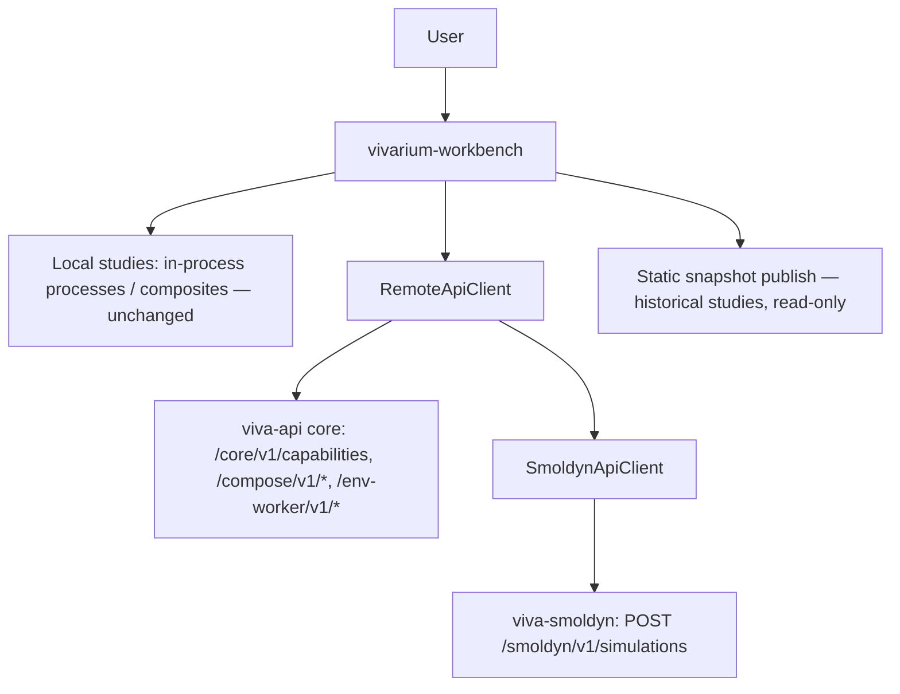

# Workbench Migration Plan: SMS Retirement + Smoldyn Remote Backend

Planning snapshot: 2026-09-21. Source inspection of `vivarium-workbench` @ `main`
(`abe18862a40ca3bf55f0137039ca9bbf68b15370`), cross-referenced against the
completed viva-api/viva-smoldyn core separation on branch `dev/viva-core`.
No implementation performed. Source, tests and client code outrank docs.

## 1. Executive Summary

The viva-api core separation removed the SMS (E. coli/ParCa/PTools) surface
from viva-api. The workbench still calls 16 retired SMS endpoints through
`vivarium_workbench/lib/sms_api_client.py`; every one of them has live callers
in views, jobs, and publish tooling. At cutover those calls return 404.

Two settled decisions drive this plan:

1. **No externally owned SMS continuation.** All live SMS views, jobs and
   client methods are removed from the workbench. Historical studies remain
   viewable through the existing static-snapshot publishing path
   (`publish.py` bakes study data into read-only bundles; `study-detail.js`
   already has a snapshot mode). A final export/publish of any live campaigns
   is an operational precondition recorded in §9 — it is the only path by
   which unreproducible live results survive.
2. **The workbench becomes a multi-simulator dashboard.** viva-smoldyn's new
   HTTP service (`POST /smoldyn/v1/simulations`) is added as a first-class
   remote backend next to the retained generic core surface (compose,
   env-worker, capabilities).

Recommended strategy: **split the client, then move features.** Extract the
retained generic methods into `lib/remote_api_client.py`, add a small
`lib/smoldyn_api_client.py` on the same circuit-breaker/timeout plumbing,
retire the SMS methods with their views in one coherent phase, and wire a
Smoldyn remote-run path that is honest about the endpoint's synchronous,
bounded nature (§5.2). Do not build a durable-job queue in the workbench to
compensate for one the Smoldyn service does not have.

## 2. Scope and Non-Goals

Inspect the workbench's remote-API surface, classify every client method
against the post-separation viva-api spec, and produce this plan.

No source edits were made during planning. This plan covers the workbench
repository only. viva-api and viva-smoldyn are stable counterparts here; their
separation work is complete and audited (see
`.separation-validation/` evidence and `CORE_SEPARATION_EXECUTION.md`).

Non-goals: re-introduce SMS anywhere; proxy Smoldyn through viva-api (that
deviation was deliberately removed — clients call viva-smoldyn directly);
build durable remote Smoldyn jobs (a viva-smoldyn product decision, §7);
migrate or delete historical SMS databases (owner-gated, §9); change the
local in-process study execution path (unchanged by this plan).

## 3. Current State

### 3.1 Client surface inventory

`SmsApiClient` (`lib/sms_api_client.py`) makes 33 calls across four URL
families. Classification against the current viva-api OpenAPI:

| Client method | Endpoint | Status in viva-api | Workbench callers (non-client) |
|---|---|---|---|
| `start_env_worker` / `env_worker_status` / `stop_env_worker` | `/env-worker/v1/workers*` | RETAINED | remote worker tooling |
| `start_relayed_env_worker` / `call_relayed_env_worker` / `stop_relayed_env_worker` | `/env-worker/v1/relay/*` | RETAINED | relay tooling |
| `submit_env_worker_task` / `get_env_worker_task` / `cancel_env_worker_task` | `/env-worker/v1/tasks*` | RETAINED | `env_worker.py` |
| `capabilities` | `/core/v1/capabilities` | RETAINED (payload now `{version, capabilities: [...]}`; proxy strings removed) | `lib/server_capabilities.py` (parses generically — compatible) |
| `ping` | health/home probe | RETAINED | circuit breaker, link checks |
| `compose_check` / `compose_submit` / `compose_status` / `compose_status_batch` / `download_compose_results` | `/compose/v1/*` | RETAINED | `preflight.py`, `remote_run.py`, `run_jobs.py` |
| `latest_simulator` | `/core/v1/simulator/latest` | RETIRED (404) | `remote_pinned.py`, `source_build_views.py` |
| `register_simulator` / `upload_simulator` | `/core/v1/simulator/upload` | RETIRED | `source_build_views.py`, `remote_run_views.py`, `remote_run_jobs.py` |
| `simulator_status` | `/core/v1/simulator/status` | RETIRED | `remote_run_views.py`, `remote_pinned.py`, `comparison_pinning.py`, `remote_run_jobs.py` |
| `list_simulators` | `/core/v1/simulator/versions` | RETIRED | `remote_build_source.py`, `remote_simulations.py`, `remote_pinned.py`, `comparison_pinning.py` |
| `composite_resolve` | `/core/v1/simulator/{id}/composite-resolve` | RETIRED | `models.py`, `remote_pinned.py` (note: `publish.py`/`composite_config_adapt.py` hit the *local* `lib/composite_resolve.py` — not SMS) |
| `download_workspace` | `/api/v1/simulations/workspace` | RETIRED | `remote_build_source.py` |
| `list_build_simulations` | `/api/v1/simulations?simulator_id=` | RETIRED | `remote_simulations.py` |
| `simulation_status` / `get_simulation` | `/api/v1/simulations/{id}[...]` | RETIRED | `investigations_index.py`, `study_page.py`, `report_views.py`, `remote_run_views.py`, `remote_analysis_figures.py` |
| `simulation_chain_progress` | `/api/v1/simulations/{id}/chain-progress` | RETIRED | `remote_run_views.py` |
| `observables` | `/api/v1/simulations/{id}/observables` | RETIRED | `server.py`, `env_worker.py` |
| `run_simulation` | `POST /api/v1/simulations` | RETIRED | `composite_test_run_views.py`, `composite_run_views.py` (JS hits are comments/docs) |
| `run_analysis` / `analysis_status` / `list_analyses` | `/api/v1/simulations/{id}/analysis*`, `/analyses` | RETIRED | `remote_run_landing.py`, `investigation_steps.py`, `investigation_execution.py`, `remote_run_views.py`, `remote_analysis_figures.py` |
| `download_data` | `POST /api/v1/simulations/{id}/data` | RETIRED | `remote_run_landing.py`, `remote_run_views.py`, `simulations_index.py`, `remote_run_jobs.py` |

**16 retired methods; all have callers.** Nothing dead is safely deletable
without touching views. Note the substring traps: `composite_resolve`,
`observables` and `run_simulation` match local-library/comment usages; each
retirement must be validated by call-graph, not text search.

### 3.2 How Smoldyn runs in the workbench today

Entirely local and in-process: workspace Smoldyn composites resolve through
`lib/composite_resolve.py` against the workspace tree, and published snapshots
bake resolved configs (`api/composite-resolve/<id>.json`) and run
visualizations (`api/composite-viz/<id>.json`). The workbench never calls
viva-smoldyn's HTTP service — that service did not exist when this code was
written. `lib/` contains no `smoldyn` HTTP code at all.

### 3.3 Test coupling

`tests/test_remote_run_submit_async.py` spins a fake SMS server answering
`/api/v1/simulations`; `tests/test_api_app.py` exercises views that call
retired methods. SMS-coupled tests must be replaced, not merely deleted,
where they cover retained behavior (client plumbing, breaker policy,
submission UX) — see §6 Phase 5.

## 4. Target Architecture

- One generic remote client (`RemoteApiClient`) for the retained core surface.
- One purpose-built client (`SmoldynApiClient`) for viva-smoldyn, reusing the
  existing `RemoteLink` circuit breaker (keyed by `base_url`, so a new
  endpoint needs no breaker changes) and the `for_()` call-class timeout
  policy pattern.
- SMS views retire; published snapshots remain the read-only history.

## 5. viva-smoldyn Backend Design

### 5.1 New client

**PROPOSED NEW FILE** `vivarium_workbench/lib/smoldyn_api_client.py`:

- `run_simulation(payload: dict) -> dict` — `POST /smoldyn/v1/simulations`
  with strict request model (unknown fields rejected server-side; the client
  should pre-validate against the published contract to fail fast).
- Timeouts from the call-class policy: the service's default operator cap is
  15 s wall time; the client timeout must exceed `MAX_SECONDS` plus spawn
  overhead (recommend 25–30 s) and no retries (POSTs are not idempotent).
- Error mapping: 422 → validation detail surfaced to the run panel; 413 →
  resource-limit message; 503 → capacity/runtime; 504 → timeout. Responses
  carry only `detail.code`, safe message and request ID — display those.

### 5.2 Honest scope: synchronous, counts-only

The Smoldyn endpoint is a bounded synchronous run: it returns
`samples[]` with `time` and `molecule_counts` in the response body. It has no
job IDs, no status polling, no artifact URLs, no observables index, no
analysis. Therefore:

- Remote Smoldyn runs get a **quick-run panel** (submit → wait → table/plot of
  counts), not the campaign-style dashboard built for durable SMS jobs.
- "Download results" = persist the JSON response client-side; no artifact
  transport phase.
- Composite → request translation is a new adapter (next
  to `lib/composite_config_adapt.py`): workspace composite species/reactions/
  bounds/dt/duration/seed → API body. The endpoint's validation subset
  (unimolecular reactions only, ≤64 species, ≤128 reactions, four colors,
  counts-only) means some composites are **not remotely runnable** — the
  adapter must surface a precise pre-flight rejection instead of a round-trip
  422. Local execution remains available for everything the endpoint rejects.

### 5.3 Configuration

New settings alongside the existing remote endpoint config: a Smoldyn base
URL (unset = backend hidden, matching how the workbench treats other
optional links) surfaced in server capabilities with the same generic
parsing that already works.

## 6. Phased Work Plan

Order matters: split plumbing before features, retire SMS once, gate with
tests at each phase boundary.

### Phase 0 — Baseline (no behavior change)

- Record current route usage: add a repo test (`tests/test_retired_sms_scan.py`)
  that fails if any retired endpoint path string reappears in `lib/` or
  `server.py` source. This becomes the permanent anti-regression gate (§8).
- Verify `publish.py` builds a full static snapshot of the current workspace
  and record it as the read-only-history reference bundle.

### Phase 1 — Client split (plumbing only, no view changes)

- Create `lib/remote_api_client.py` containing all RETAINED methods and the
  shared `_get/_post/_delete`, breaker, and `for_()` machinery moved out of
  `sms_api_client.py`.
- Keep `sms_api_client.py` as a deprecation shim: `SmsApiClient = RemoteApiClient`
  plus the retired methods raising a typed `RetiredEndpointError` (not 404
  discovery-by-accident). Update imports mechanically; the shim keeps the
  rename reviewable.
- Tests: existing fake-server tests repointed to the new module; breaker and
  retry-policy tests unchanged.

### Phase 2 — Smoldyn backend (additive)

- Add `lib/smoldyn_api_client.py` (§5.1) and the composite→request adapter
  (§5.2) with pre-flight validation of the endpoint subset.
- Add settings/capability wiring (§5.3).
- Tests: contract tests against a fake Smoldyn service (success, 422, 413,
  503, 504, disconnect mid-run); adapter round-trip on every packaged
  viva-smoldyn composite fixture, asserting precise rejection for
  out-of-subset composites.

### Phase 3 — Smoldyn UI (additive)

- Quick-run panel on Smoldyn-capable study/composite pages: config preview →
  submit → counts table + line plot → save JSON. Reuse existing plotly
  patterns from the viz stack; no new charting dependency.
- Wire into `composite_run_views.py`'s remote-run seam as a backend choice
  ("local process" vs "remote Smoldyn service") where the composite passes
  pre-flight; SMS-backed remote composite runs are not a replacement target.

### Phase 4 — SMS retirement (the coherent break)

- Delete the 16 retired methods from the client and the shim.
- Retire views/jobs/lib modules whose sole purpose is SMS:
  `remote_build_source.py`, `source_build_views.py`, `remote_simulations.py`,
  `remote_pinned.py`, `remote_analysis_figures.py`, `remote_run_landing.py`,
  SMS paths in `remote_run_views.py` / `remote_run_jobs.py`,
  `comparison_pinning.py` (repoint to snapshots or retire),
  `investigation_steps.py` / `investigation_execution.py` analysis triggers,
  SMS branches in `simulations_index.py` / `investigations_index.py` /
  `study_page.py` / `report_views.py` / `models.py`.
- Snapshot mode untouched: `publish.py`, `lib/composite_resolve.py`,
  baked-API serving, and `study-detail.js` snapshot paths keep working — they
  never call live SMS.
- Remove SMS endpoint config (base URL handling for the retired API); startup
  logs a warning if a now-unused SMS setting is present.

### Phase 5 — Tests, docs, gates

- Replace `tests/test_remote_run_submit_async.py`'s fake SMS server with:
  fake core (compose/env-worker) tests and the Phase 2 fake Smoldyn service.
  Any test exercising submission UX moves to the Smoldyn or compose path;
  do not carry it on a retired endpoint.
- Update `docs/` references to the remote API; add a Smoldyn backend page.
- Run the full suite, the publish snapshot build, and the Phase 0 scan gate.

## 7. Deliberate Non-Feature: Durable Remote Smoldyn Jobs

The SMS dashboards are built around durable jobs (submit → poll → download →
analyze). viva-smoldyn's v1 contract intentionally provides none of that. The
workbench must not recreate a job queue client-side to fake it — that would
rebuild SMS hidden infrastructure in the wrong repository. If durable Smoldyn
jobs become a product need, the endpoint contract extends first (viva-smoldyn
owns that decision); the workbench adds polling UI afterwards.

## 8. Validation Criteria

- `rg` scan gate: no retired path strings (`/api/v1/simulations`,
  `/core/v1/simulator`, `simulations/{id}/analysis`, etc.) in `lib/`,
  `server.py`, or templates — enforced by the Phase 0 test.
- No `SmsApiClient` symbol remains after Phase 4 (rename complete).
- Full test suite passes with fake core + fake Smoldyn servers only.
- `publish.py` produces a byte-identical-or-better snapshot vs the Phase 0
  reference bundle for studies with no live-SMS data.
- Every Smoldyn-packaged composite passes adapter pre-flight (runnable) or
  returns a precise rejection reason (not runnable) — no silent 422s.
- Startup with no Smoldyn URL configured: backend hidden, all other features
  unaffected.

## 9. Owner-Gated Preconditions (outside this repository)

1. **Final live-data export.** Any historical results that exist only as live
   SMS records (GovCloud campaigns, pinned comparisons) must be exported or
   published to snapshots before the SMS deployment retires. The workbench
   cannot recover data from a decommissioned API. This is an operational
   task with a named owner — it is the single irreversible step in this
   migration.
2. **Deployment cutover order.** Workbench release that stops calling SMS
   routes must deploy before (or with) the SMS-capable viva-api build is
   decommissioned; either alone is safe, the reverse order is not.
3. **Historical database retention** remains governed by the separation
   plan's data-retention record; this migration neither reads nor deletes it.

## 10. Risks

| Risk | Mitigation |
|---|---|
| Substring matches (`composite_resolve`, `observables`) cause false-positive retirement or missed callers | Call-graph verification per method; Phase 0 scan gate catches misses |
| Snapshot history has gaps for never-published live studies | §9.1 export precondition with explicit owner sign-off |
| Composite subset surprises users ("why can't I run this remotely?") | Adapter pre-flight rejection with the specific violated constraint named |
| Sync-only endpoint reads as a downgrade | Quick-run panel is scoped honestly (§5.2); durable jobs documented as a viva-smoldyn product decision (§7) |
| Rename churn breaks in-flight branches | Phase 1 shim keeps `SmsApiClient` importable until Phase 4 |

## 11. Definition of Done

Every RETAINED method works against post-separation viva-api; the Smoldyn
backend runs packaged composites remotely within the published contract and
limits; every RETIRED method and its views are gone with no orphaned tests;
published snapshots remain the read-only history; the scan gate and full
suite pass; §9 preconditions are recorded with owners before cutover.
